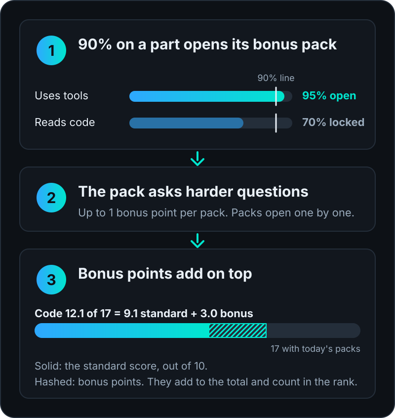

# CrucibleForge / MakoBench

[](https://github.com/LaserLloyd/CrucibleForge/actions/workflows/ci.yml)
[](LICENSE)

**MakoBench 4.5 is a low-cost benchmark anyone can run on a model they host or rent.** CrucibleForge is the engine.
It scores Code (write, fix and change code, use tools, read code) and Chat (stay in character, remember the
conversation, co-write to a brief, follow everyday instructions), each out of 10, plus bonus points from harder
packs that a model opens by scoring 90% on a part; the bonus adds on top and counts in the rank. It sorts models into
broad tiers: two single runs closer than about 0.45 Overall points cannot be told apart, and the board marks ties
itself. NSFW+ /20 (adult fiction) is shown beside Overall and is never part of it.

It is the engine behind the public [MakoBench board](https://www.laserlloyd.com/makobench/). <!-- scrub-ok: public project/site URL, deliberate -->
Current suite: **4.5.1** (`SUITE_VERSION` in `crucibleforge/version.py`), profile `bench45`.
Licence: [MIT-0](LICENSE). Author: Laser Lloyd.

<p align="center"></p>

## Test a model with one command

You need Docker (or Podman) and an [OpenRouter key](https://openrouter.ai/keys) with a few dollars of credit:

```bash
mkdir makobench
docker run --rm -it -e OPENROUTER_API_KEY=sk-or-... -v "$PWD/makobench:/data" ghcr.io/laserlloyd/crucibleforge:4.5.1 test openai/gpt-6-luna
```

- It prints a plan with the expected cost, asks `Continue? [y/N]`, and stops spending at about twice the estimate.
- Run the same command again to continue a stopped run; `--no-nsfw-plus` leaves out NSFW+ (adult fiction, never in Overall).
- At the end it prints Overall, Code and Chat, each as the total with its split (`21.6 of 34 = 16.9 standard + 4.7 bonus`), and says which file to open: `makobench/results/report.html`.
- Windows and macOS forms, local models, costs, safety and troubleshooting: [docs/FIRST-RUN-DOCKER.md](docs/FIRST-RUN-DOCKER.md).

**Without Docker** (Python 3.13 and [uv](https://docs.astral.sh/uv/)): `git clone https://github.com/LaserLloyd/CrucibleForge.git && cd CrucibleForge && uv sync`, <!-- scrub-ok: public repo URL -->
then `uv run crucibleforge-test openai/gpt-6-luna` does the same. The full CLI is
`crucibleforge all --models <label> --judge <provider>:<judge-model-id>` ([docs/RUNNING.md](docs/RUNNING.md)).
On Overall /20 (Code plus Chat, sets the rank), Code /10, Chat /10 and `±` (the 90% range of one run), see
[The scores](#the-scores). The judge: [docs/JUDGE.md](docs/JUDGE.md); MakoBench's own board uses it locally at 8-bit.

## The scores

Code and Chat are each worth 10 points; **Overall /20 is their sum**. The weights are read from the profile by
`tests/test_readme_matches_profile_45.py`.

<!-- parts:begin -->
| Section | Segment | Points | What it asks |
| --- | --- | --- | --- |
| Code | Writes working code | 4 | Write small programs from 18 briefs that leave obvious details unsaid (19 functions in all); hidden tests check them |
| Code | Fixes and changes existing code | 3 | Find and fix bugs in a small program, or change it, without breaking what works |
| Code | Uses tools | 2 | Finish three scripted tool dialogues by the rules, step by step (1 point), and 30 seeded tool tasks (1 point) |
| Code | Reads code | 1 | Say what a short program prints, including one for a made-up machine |
| Chat | Stays in character | 4 | Hold a role-play scene under rules the user keeps pushing, and two long scenes |
| Chat | Remembers the conversation | 3.5 | Bring back earlier facts, keep a ledger and work out totals |
| Chat | Co-writes to a brief | 1.5 | Write to a brief with stated constraints and required elements |
| Chat | Everyday instructions | 1 | Small checked tasks (format, word problems, a document) and saying NOT STATED when the document does not say |
<!-- parts:end -->

<p align="center"></p>

**NSFW+ /20, shown apart.** NSFW /10 (Erotica 4, Adult role-play 2.5, Range 2, Anatomy 1.5) plus Uncensored /10
(Willingness 6, Knowledge 4), printed in its own column beside Overall and never part of it; both halves are
printed too. Points come from checks and the judge's classing, never from taste or writing quality.

Every segment with its rows and grader: [docs/WHAT-IS-TESTED.md](docs/WHAT-IS-TESTED.md). Every question, one line
each: [docs/TESTS-BY-COMPONENT.md](docs/TESTS-BY-COMPONENT.md). The rules for refusals, empty and cut replies:
[docs/SCORING.md](docs/SCORING.md) and [docs/SCORING-RULES-45.md](docs/SCORING-RULES-45.md).

## Bonus packs

A part scored at 90% or more opens a harder bonus pack. Each pack is worth up to 1 bonus point, and the points add
on top: Code total = Code (10) + Code packs, Chat total likewise, Overall = Code total + Chat total, printed with its
split (`20.7 of 34 = 16.9 standard + 3.8 bonus`). The rank is on that total. With today's packs the maximums are
17, 17 and 34; they grow as packs are added. On the bars the bonus is drawn hashed on top of the solid standard part.
NSFW+ packs add inside NSFW and Uncensored and never enter Overall. How packs work and how to write one:
[docs/PACKS.md](docs/PACKS.md).

<p align="center"></p>

## Methodology

- **Fixed questions.** Every model gets the same question sets. Generated items come from the release seed `4.5.0`
  and fixed card seeds, so two runs ask the same questions.
- **Same conditions.** Each model runs with its maker's recommended sampler, its default thinking and the same
  output budgets. The first reply a unit produced is the one scored; a retry counts only after an infrastructure
  failure, or when 4.5.1 owes the unit again (a reply cut under 4.5.0's lower budget).
- **Code checks first.** Code is run in a sandbox, answers are compared with keys written in advance, and rules are
  checked by code. Only what code cannot check goes to the judge.
- **One judge.** On the published board the plain Qwen 3.8 27B, run locally at 8-bit (Q8), grades the role-play
  sessions, the long chat scenes and the NSFW+ classing, with a quoted line as evidence. There is no second reader.
- **Ranges from repeat runs.** The `±` beside a score is a 90% range measured from whole runs repeated on the same
  models. One run: Code ±0.22, Chat ±0.29, Overall ±0.31 on the standard score. The total's range is printed beside
  it, because a pack can open in one run and not in another; the 2.5% accuracy bar was set for the standard score.
  NSFW+ needs two runs to get under 5%.
- **Rank.** Rank = 1 + the number of models clearly better on the total (90% interval of the difference above
  zero). A shared place means that pair cannot be told apart, so a list can read 1=, 1=, 1=, 2, 4=: the fourth model
  is clearly behind one of the top three but not the other two, and the fifth is clearly behind three models.
- **Packs.** A part scored at 90% or more unlocks a harder bonus pack whose points add to the total. List them
  with `crucibleforge pack list`; how they work: [docs/PACKS.md](docs/PACKS.md).
- **Published per run.** Each score with its range and source, run settings, minutes and cost. Every row stores
  its grader and judge stamps, so a changed grader marks old rows stale (`report --check-stale`).

How the benchmark itself was checked (repeat runs, judge audit, kill tests, reviews): [docs/VALIDATION.md](docs/VALIDATION.md).

## Reading the board

| You see | It means |
| --- | --- |
| **Overall** | Code total plus Chat total, with its split (`20.7 of 34 = 16.9 standard + 3.8 bonus`), printed only when both are complete; otherwise `x of y measured, not ranked`. |
| `6.4 of 7.5` | Points measured out of the measured maximum; nothing is scaled up over a missing segment. |
| `±` | The 90% range, with its source beside it. |
| `2=` | Shares its place: no model in that place is clearly better than it. |
| **Pack points** | The bonus in each total, per pack. `locked` = the part is under 90%. |
| `pending` / `not run` | Waiting for something / never run (never 0). |
| `not measured (n of m replies cut)` | Too many replies hit the token ceiling; the part adds nothing. |

Every column and mark: [docs/SCORING.md](docs/SCORING.md#board-columns).

**The judge.** `--judge <provider>:<model-id>` takes any model, local or hosted. The scores published on MakoBench
are judged by Qwen 3.8 27B run locally at 8-bit (Q8). Rows judged by another judge are scored and ranked on your
board and marked ⚖ with the judge's id. `--no-judge` scores what code can grade and leaves the judged
segments pending. More: [docs/JUDGE.md](docs/JUDGE.md).

## What it does not measure

General question answering, repository-scale coding or long agent loops, long-document work beyond a small check,
summarising, translation, vision and voice, and the top of the frontier, where the standard test is at its ceiling.
It grades behaviour, never a refusal as a virtue. Who it suits: [docs/SCORING.md](docs/SCORING.md#who-it-is-for).

## Install

CrucibleForge runs from a git checkout with `uv sync`. A wheel or `pip install` is not supported: the cases,
profiles and `models.example.yaml` live outside the Python package. Python 3.12 or newer works; the commands above
use 3.13, the version the Docker image uses. Coding answers run in a `bubblewrap` sandbox, so on Linux install
`bwrap`. Step by step for each system: [docs/INSTALL.md](docs/INSTALL.md).

The 4.1 test is frozen under `archive/4.1.0/` and runs with `--profile bench`; its rows do not mix with 4.5.

## Docs

| Doc | What |
| --- | --- |
| [docs/INSTALL.md](docs/INSTALL.md) | Windows, Linux and macOS, Docker or native, upgrade and uninstall |
| [docs/RUNNING.md](docs/RUNNING.md) | Running a model, the pipeline stages, the conformance gate, spend caps, the GUI |
| [docs/CONFIG.md](docs/CONFIG.md) | Providers and backends, `models.yaml`, hosted APIs and prices |
| [docs/CLI.md](docs/CLI.md) | Every command and flag, grouped by task |
| [docs/WHAT-IS-TESTED.md](docs/WHAT-IS-TESTED.md) | Every segment and pack: what it asks, rows, how it is graded |
| [docs/TESTS-BY-COMPONENT.md](docs/TESTS-BY-COMPONENT.md) | Every question in the standard run, one line each |
| [docs/SCORING.md](docs/SCORING.md) | The score tree, the judge, ranges and ties, every board column, known limits |
| [docs/SCORING-RULES-45.md](docs/SCORING-RULES-45.md) | What each outcome scores (refused, softened, filtered, cut, empty), and the marks files |
| [docs/VALIDATION.md](docs/VALIDATION.md) | How 4.5 was validated: repeat runs, the range method, judge audit, kill tests, reviews |
| [docs/PACKS.md](docs/PACKS.md) | The bonus packs and how to write the next one |
| [docs/DESIGN.md](docs/DESIGN.md) | Thinking models, failure handling, the sandbox, GPU leases |
| [docs/CASES.md](docs/CASES.md), [docs/CUSTOM-TESTS.md](docs/CUSTOM-TESTS.md) | Adding cases, your own private tests |
| [docs/CONTENT-RULES.md](docs/CONTENT-RULES.md) | What new tests never include |
| [docs/DEVELOPING.md](docs/DEVELOPING.md) | Repository layout, tests, the publishing scrub check |
| [docs/FIRST-RUN-DOCKER.md](docs/FIRST-RUN-DOCKER.md), [docs/DOCKER.md](docs/DOCKER.md), [docs/deploy/docker.md](docs/deploy/docker.md) | The container image: first run, quick setup and the always-on service |
| [docs/OPENCLAW.md](docs/OPENCLAW.md) | Driving CrucibleForge from an agent framework |
| [CHANGELOG.md](CHANGELOG.md), [SECURITY.md](SECURITY.md) | Release history, reporting a vulnerability |

On the site: [How MakoBench works](https://www.laserlloyd.com/makobench/docs/how-makobench-works/) and <!-- scrub-ok: public project/site URL, deliberate -->
[Run CrucibleForge on your own models](https://www.laserlloyd.com/makobench/docs/run-crucibleforge-on-your-own-models/). <!-- scrub-ok: public project/site URL, deliberate -->

## Content warning

The benchmark measures adult-fiction ability and how a model handles pressure, so some case files and the NSFW+
generators hold material you may not want to read. Every participant is an adult; the limits are in
[docs/CONTENT-RULES.md](docs/CONTENT-RULES.md). Model outputs (`results/`) never enter the repository. Leave NSFW+
out with `--no-nsfw-plus`, or skip categories with `--categories`.

## Licence

MIT No Attribution ([MIT-0](LICENSE)). You do not need to credit this project, but a link back is appreciated.
Releases up to 3.7.0 were MIT. The embedded board font is under the SIL Open Font License.
